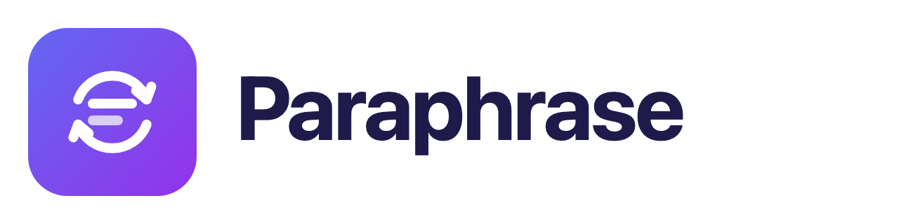

An Android app that rewrites selected text with AI, in place, inside **any** other app.

Select text anywhere → tap **Paraphrase** in the selection popup → the selection is
replaced with the rewritten version.

## How it works

Android has a first-class API for this: `ACTION_PROCESS_TEXT`. Any app that declares an
activity with that intent filter shows up in the floating text-selection toolbar
(next to Cut / Copy / Share) in every app on the device. When the selection is editable,
whatever the activity returns in `EXTRA_PROCESS_TEXT` is written back over the selection
by the host app itself.

No accessibility service, no overlay permission, no custom keyboard, no root.

    Selection toolbar  ──ACTION_PROCESS_TEXT──▶  ProcessTextActivity
                                                        │
                                                   AI provider
                                                        │
    Host app replaces selection  ◀──EXTRA_PROCESS_TEXT──┘

When the selected text is *read-only* (a web page, someone else's chat bubble) there is
nowhere to write back to, so the result is shown in the popup and copied to the clipboard.

## Free AI providers

Pick one in the app and paste a key. Keys are stored only in the app's private
SharedPreferences and are sent only to the provider you chose.

| Provider | Free tier | Get a key |
|---|---|---|
| **Google Gemini** (default, `gemini-3.8-flash`) | Free tier, no card | https://aistudio.google.com/app/apikey |
| **Groq** (`llama-3.3-70b-versatile`) | Free tier, daily limits, fastest | https://console.groq.com/keys |
| **Cerebras** (`llama-3.3-70b`) | ~1M tokens/day | https://cloud.cerebras.ai |
| **Mistral** (`mistral-small-latest`) | Large monthly quota, requires opting in to training | https://console.mistral.ai/api-keys |
| **OpenRouter** (`...:free` models) | Free models, one key | https://openrouter.ai/keys |
| **Hugging Face** (router endpoint) | Rate-limited free tier | https://huggingface.co/settings/tokens |
| **Ollama Cloud** (`gpt-oss:120b-cloud`) | Free tier, metered in GPU time | https://ollama.com/settings/keys |
| **Ollama** on your own machine | Free, no key, no quota | https://ollama.com/download |
| **LM Studio** on your own machine | Free, no key, no quota | https://lmstudio.ai |
| **Other OpenAI-compatible** | Depends on the endpoint | — |
| **On-device basic rewriter** | Always free, works offline | no key needed |

Ollama Cloud runs the same models without a GPU of your own. Its OpenAI-compatible
route (`https://ollama.com/v1`) is what the community reports and is not spelled
out in Ollama's own docs, so the Server URL stays editable for that preset — if a
call 404s, correct the URL rather than waiting for an app update.

To use Ollama or LM Studio locally, both the phone and the computer must be on the same
network. Start Ollama with `OLLAMA_HOST=0.0.0.0 ollama serve` (or tick "serve on
network" in LM Studio) and put the computer's LAN address in the Server URL
field, e.g. `http://192.168.1.42:11434/v1`. Nothing leaves your network.

The on-device option is a plain phrase/synonym rewriter, not a model — it is the fallback
when no key is set so the app does something useful out of the box, but the quality is not
comparable. Set a key for real paraphrasing.

Cleartext HTTP is permitted, because a self-hosted server on the LAN serves plain
HTTP and Android's network security config cannot express "private ranges only".
Every hosted provider above is HTTPS; the only cleartext destination is one the
user typed in themselves.

## The landing page

First launch opens an animated landing screen instead of a settings form, because
the one thing that is hard to explain in words is that the rewrite happens *inside
someone else's app*. So the page replays it: the sentence gets selected, Android's
floating toolbar slides in, **Paraphrase** pulses, and the text retypes itself into
the rewritten version, ending on "Replaced in place".

It is interactive, not a video:

- the **style chips** rewrite the demo sentence on the spot (Standard / Formal /
  Casual / Concise), each morphing from whatever is currently on screen
- **tapping the card** replays the whole sequence
- feature rows fade up as they scroll into view, and the aurora background drifts
  against the scroll
- everything collapses to a static page when the system "remove animations"
  accessibility setting is on (`Motion.enabled`)

It is shown once. After that the launcher icon goes straight to setup, and
**How it works** in the setup header brings the page back.

## Using it

1. Open **Paraphrase**, choose a provider, paste your key, tap **Save**.
2. In any app, long-press text and drag the handles over what you want rewritten.
3. Tap **Paraphrase** in the popup toolbar (it may be under the **⋮** overflow — Android
   shows the most-used actions first, and it moves up the list as you use it).
4. The text is replaced.

**Instant replace** (on by default) swaps the text as soon as the first result arrives.
Turn it off to get a preview card first, with the original, the rewrite, style chips
(Standard / Fluent / Formal / Casual / Concise / Expand / Simple English) and
Copy / Regenerate / Replace.

Paraphrase also appears in any app's **Share** sheet for text.

## Publishing to Google Play

Everything that does not need a Google account is prepared under [`play/`](play):
listing copy, store icon and feature graphic, device screenshots, Data safety
answers, and a step-by-step runbook in [`play/RELEASE.md`](play/RELEASE.md).
The privacy policy is [`PRIVACY.md`](PRIVACY.md).

```bash
./gradlew bundleRelease   # app/build/outputs/bundle/release/app-release.aab
```

The release build is minified and resource-shrunk (~1.7 MB) and is signed only
if you create `keystore.properties` from the sample — see the runbook, which
also covers the Play Console steps, the 12-tester/14-day closed-test rule for
new personal developer accounts, and the optional GitHub Actions workflow that
uploads tagged builds to the internal track.

## Build

```bash
./gradlew :app:assembleDebug          # APK at app/build/outputs/apk/debug/app-debug.apk
./gradlew :app:testDebugUnitTest      # unit tests
./gradlew installDebug                # build + install on a connected device
```

Requires JDK 17 and Android SDK 36. `local.properties` must point at your SDK
(`sdk.dir=/path/to/Android/sdk`).

## Source map

| File | Role |
|---|---|
| `ProcessTextActivity.kt` | The selection-popup entry point; also handles Share. |
| `ParaphraseEngine.kt` | Prompt construction, HTTP, provider dispatch. |
| `ResponseParser.kt` | Response parsing and output cleanup (unit tested). |
| `OfflineRewriter.kt` | No-key on-device fallback rewriter. |
| `MainActivity.kt` | Setup screen and playground. |
| `Provider.kt` | Providers and rewrite styles. |
| `LandingActivity.kt` | Animated landing page and its demo sequencer. |
| `AuroraView.kt` | Drifting gradient background, day/night palette. |
| `TextMorpher.kt` | Selection sweep and sentence-retype animations. |
| `Motion.kt` | Honours the system "remove animations" setting. |
| `Report.kt` | In-app reporting of AI output, required by Play's GenAI policy. |

## Notes / limits

- The toolbar item is labelled from the activity's `android:label`; Android decides
  whether it is shown inline or in the overflow, and reorders by usage. Apps can't
  force their position.
- Some apps use custom selection toolbars (a few browsers, some chat apps) and won't
  show third-party `PROCESS_TEXT` actions at all. Most stock text fields do.
- Selections over 8000 characters are rejected before any network call.

## Icon and theming

The launcher icon is an adaptive icon with three layers:

- **background** — an indigo → violet gradient vector
- **foreground** — the mark: two lines of text inside a rewrite cycle, drawn as
  stroked paths so it stays sharp at every density and still reads at 48dp
- **monochrome** — the same geometry as a single colour, which is what Android 13+
  tints for themed icons, so the icon follows the user's light or dark wallpaper
  theme instead of staying a fixed square

The UI ships a full day/night palette (`values/colors.xml` and
`values-night/colors.xml`): brand indigo darkens to a lighter indigo on dark so
contrast holds, and the landing aurora goes from pastel-on-white to deep-on-black.
Both screens draw edge to edge with the system bars handled through insets.
